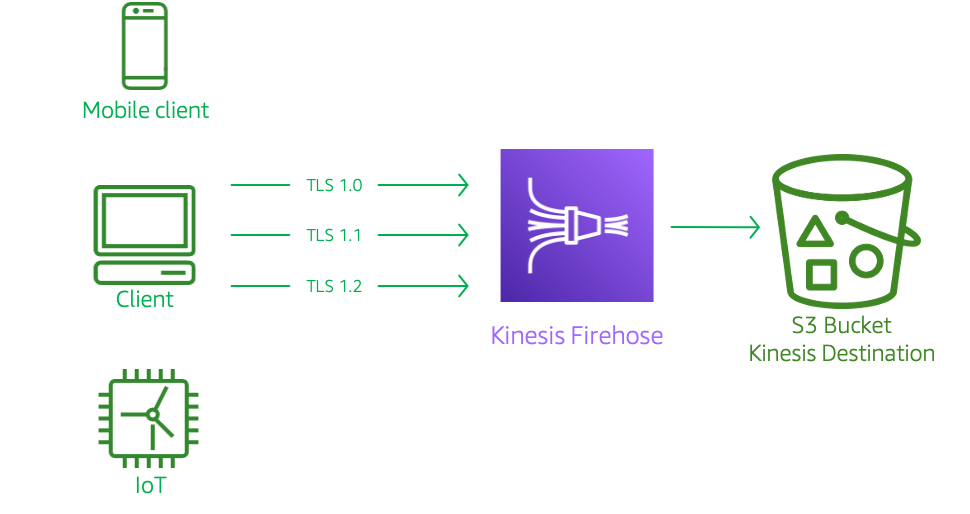
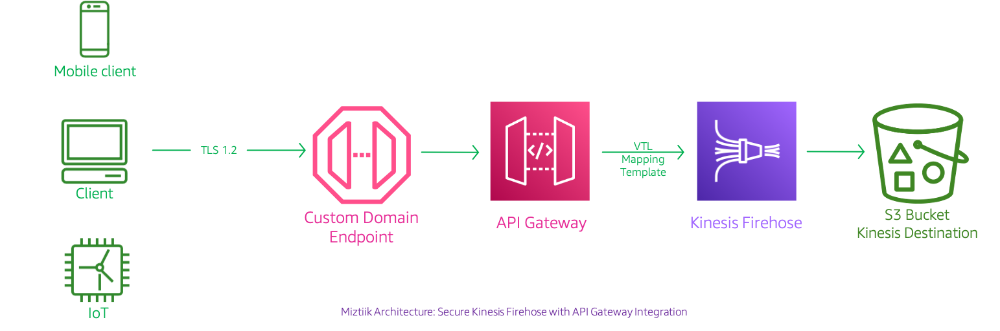
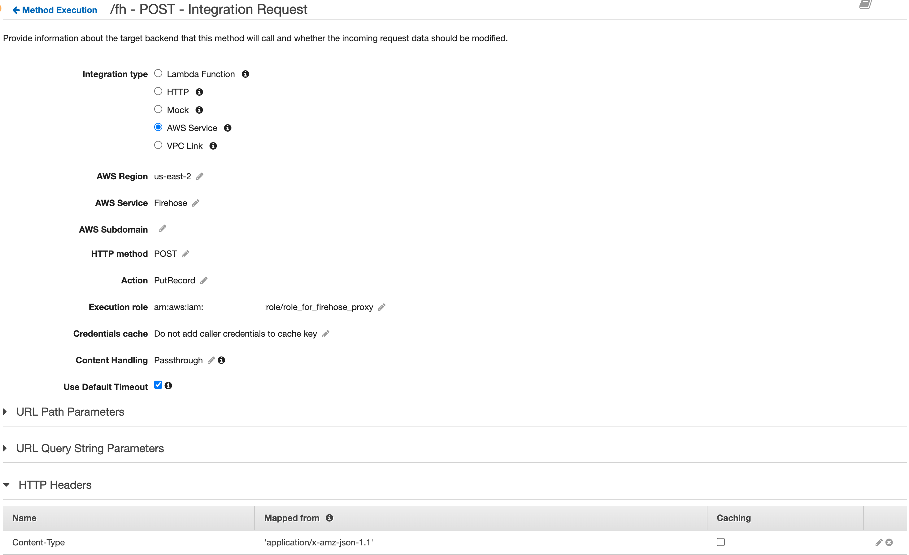
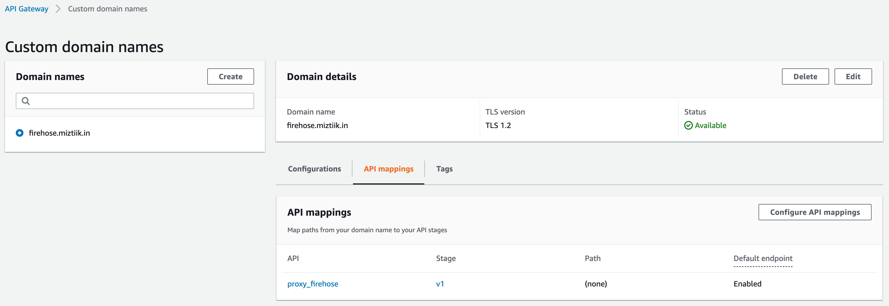
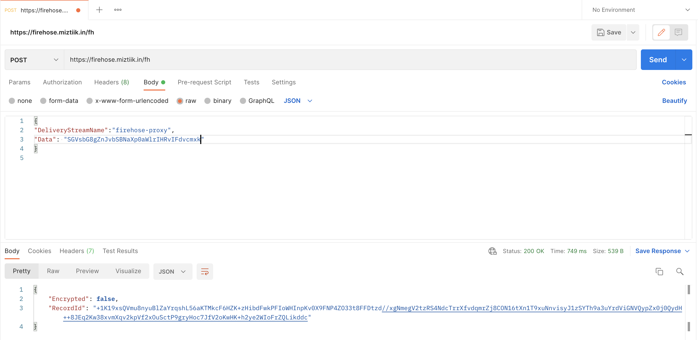
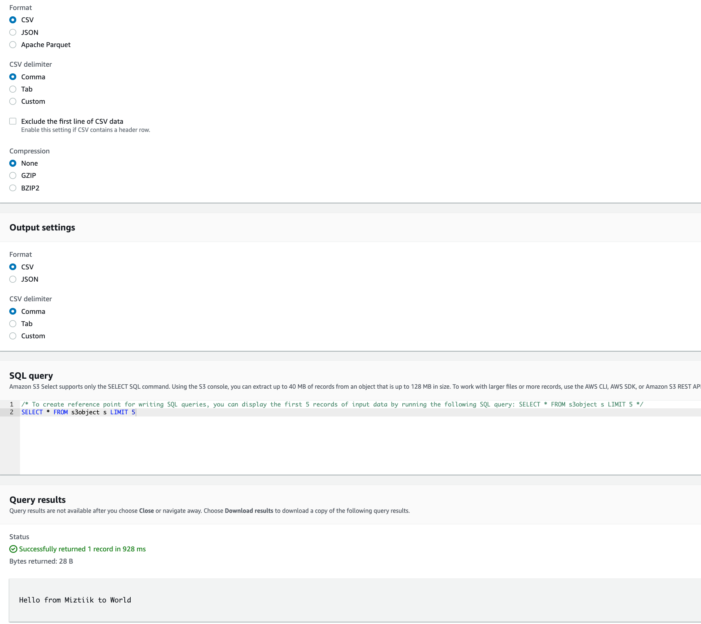
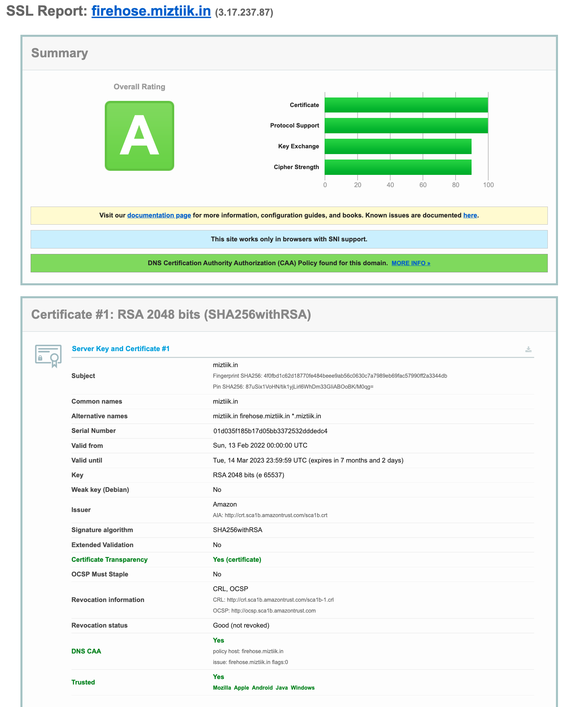
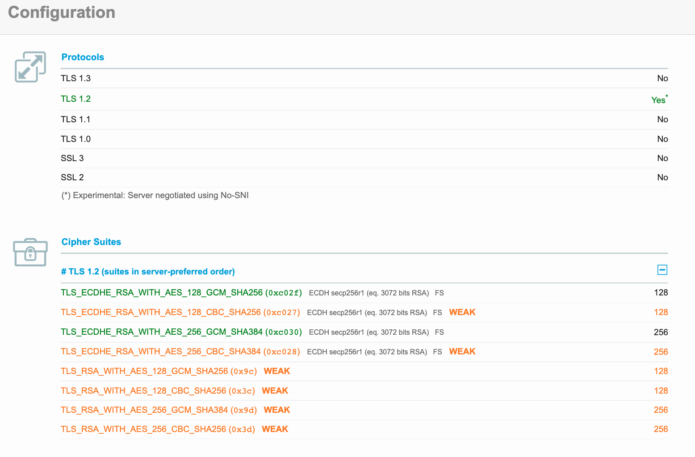

# API Gateway Proxy for Kinesis Firehose

Event-driven architectural pattern is used by the developers at Mystique Unicorn to process streaming data. For example, An application running in a set-top-box(STD) can ingests a streams of events for video quality,  network latency and STB uptime etc. A security audit found out the stream ingestion endpoints used by the application supports TLS ciphers `1.0` and `1.1`. The developers are looking for solutions to mitigate this issue.

Can you show help them?

## 🎯 Solutions

Mystique unicorn is running an architecture similar to the one shown here.


As of Q1 2022, the endpoints of kinesis firehose and few other AWS services accept TLS ciphers `1.0`, `1.1` and `1.2`. The FIPS endpoints support TLS `1.2` only. As the FIPS endpoints are available only in the US region, they could not be used for applications running in other regions. One way to do that is to use the API Gateway service integration to act as a proxy for the kinesis service. This allows us to add a custom domain name for the api with the necessary TLS ciphers.

_Update Jun2022 - AWS announces TLS `1.2` to become the minimum TLS protocol level for all AWS API endpoints by [June 28, 2023][1]_



In this blog, I will show you how to setup this architecture and test the supported TLS ciphers. We will be first create a kinesis firehose to receive events from producers like set-top boxes/IoT devices and a S3 bucket to store our events. To proxy the kinesis firehose, An API Gateway with AWS integration will be configured with custom domain.

1. ## 🧰 Prerequisites

   This demo, instructions, scripts and cloudformation template is designed to be run in `us-east-2`. With few modifications you will be able to run in other regions as well(_Not covered here_).

   - 🛠 AWS CLI Installed & Configured - [Get help here](https://youtu.be/TPyyfmQte0U)
   - 🛠 AWS CDK Installed & Configured - [Get help here](https://www.youtube.com/watch?v=MKwxpszw0Rc)
   - 🛠 Python Packages, _Change the below commands to suit your OS, the following is written for amzn linux 2_
     - Python3 - `yum install -y python3`
     - Python Pip - `yum install -y python-pip`
     - Virtualenv - `pip3 install virtualenv`

2. ## ⚙️ Setting up the environment

   - Get the application code

     ```bash
     git clone https://github.com/miztiik/apigw-proxy-for-firehose
     cd apigw-proxy-for-firehose
     ```

3. ## 🚀 Prepare the dev environment to run AWS CDK

   We will use `cdk` to make our deployments easier. Lets go ahead and install the necessary components.

   ```bash
   # You should have npm pre-installed
   # If you DO N0T have cdk installed
   npm install -g aws-cdk

   # Make sure you in root directory
   python3 -m venv .venv
   source .venv/bin/activate
   pip3 install -r requirements.txt
   ```

   The very first time you deploy an AWS CDK app into an environment _(account/region)_, you’ll need to install a `bootstrap stack`, Otherwise just go ahead and deploy using `cdk deploy`.

   ```bash
   cdk bootstrap
   cdk ls
   # Follow on screen prompts
   ```

   You should see an output of the available stacks,

    ```bash
    sales-events-bkt-stack
    firehose-stack
    apigw-proxy-for-firehose-stack
    ```

4. ## 🚀 Deploying the application

   Let us walk through each of the stacks,

    - **Stack: sales-events-bkt-stack**

      This stack will create the s3 bucket. We will add a bucket policy to delegate all access management to be done by access points. _Although not required for this demo, we may use it in the future_.

      Initiate the deployment with the following command,

      ```bash
      cdk deploy sales-events-bkt-stack
      ```

      After successfully deploying the stack, Check the `Outputs` section of the stack. You will find the `SalesEventsBucket`.

   - **Stack: firehose-stack**
     This stack will create a kinesis firehose with S3 bucket `SalesEventsBucket` as the destination configuration. We will leave the compression, logging, batching to defaults for this demo.

     Initiate the deployment with the following command,

     ```bash
     cdk deploy firehose-stack
     ```

     After successfully deploying the stack, Check the `Outputs` section of the stack for the firehose delivery stream name and Arn. 

   - **Stack: apigw-proxy-for-firehose-stack**
     This stack will create an API with AWS Integration. The important configurations are in the Integration Request and Response. The Cfn template configure the API action for kinesis firehose to 'PutRecord'.

     - **Integration Request**:
        1. Add header `Content-Type` with value `'application/x-amz-json-1.1'`
        1. Add a request template for `application/json`. The value is an Apache Velocity Template(VTL) structure. In this demo, we will use a simple even payload with two keys `DeliveryStreamName` and `Data`. Kinesis expects the records to be base64 encoded. We could handle that in VTL, but to simply things, We will do that in the client side. The Value in this demo looks like this,

            ```vtl
            #set($inputRoot = $input.path('$'))
            {
                "DeliveryStreamName": "$inputRoot.DeliveryStreamName", 
                "Record": {"Data": "$inputRoot.Data"}
            }
            ```
        

     - **Integration Response**:
       1. We will add a successful response code `200` with this template `"application/json": ""`
       2. You can consider adding catch all response for `4xx` and `5xx` error codes

      

     Initiate the deployment with the following command,

     ```bash
     cdk deploy apigw-proxy-for-firehose-stack
     ```

     After successfully deploying the stack, Check the `Outputs` section of the stack. You will find the `**API Endpoint**`.

   - **Configure Custom Domain for API**
  
     This is the tricky bits of the solution. You will need a domain in route 53. This will allow us to create a custom subdomain that will be used to proxy our API Gateway. In my case, i have created `A` record `firehose.miztiik.in` to point to my API Gateway. I have also configured ACM for that domain.

     Next step is to create a API GW custom domain, Ensure you select `TLS1.2` for your domain. Now lets create route mapping to our stage[2]. This took some time to get it right. 
     

     Now we are all set to test our API.

5. ## 🔬 Testing the solution

   1. **Insert Record to Kinesis**

      We should be able to use our custom domain name url to insert records to our kinesis firehose. You can use a tool like Postman or cURL to insert kinesis record. _Remember that kinesis expects the data to be base64 encoded._ The inserted record should be stored as
      

      If you naviagate to the s3 bucket and use S3 Select, you should be able to find the newly inserted record.
      

      If you are planning to use CLI

      ```bash
        curl --location --request POST 'https://firehose.miztiik.in/fh' \
          --header 'Content-Type: application/json' \
          --data-raw '{
              "DeliveryStreamName": "firehose-proxy",
              "Data": "SGVsbG8gZnJvbSBNaXp0aWlrIHRvIFdvcmxkMg=="
          }'
      ```

      Expected output,

      ```bash
      {
        "Encrypted" : false,
        "RecordId" : "G7FSnFt8z9LXw+XPcBXXuSzsw2+/elTSaP0OuGxUMe5bnGefYn4A9DmBZLPeqZCgkcb9dqk3lk5xi0PnQD6pSttUa6ldSTsLpz+eLfGPHQQr5TgOxJ/qYG/g4ePxSt3CfBVptftdJBRTQShDE3r6SdvyDGAo53g++15LAhfZXpw9pWeakxCNhkF/grRDWnoFvhRdgUiS43uKvmpgezdWD8rfKgGS2UoU"
      }
      ```

      You can use a site like `https://www.ssllabs.com/` to check TLS version supported,

      

      

      

6. ## 📒 Conclusion

That is how we use API GW to proxy kinesis Firehose and enforce `TLS1.2`.

1. ## 🧹 CleanUp

If you want to destroy all the resources created by the stack, Execute the below command to delete the stack, or _you can delete the stack from console as well_

- Resources created during [Deploying The Application](#-deploying-the-application)
- Delete CloudWatch Lambda LogGroups
- _Any other custom resources, you have created for this demo_

```bash
# Delete from cdk
cdk destroy

# Follow any on-screen prompts

# Delete the CF Stack, If you used cloudformation to deploy the stack.
aws cloudformation delete-stack \
  --stack-name "MiztiikAutomationStack" \
  --region "${AWS_REGION}"
```

This is not an exhaustive list, please carry out other necessary steps as maybe applicable to your needs.

## 📌 Who is using this

This repository aims to show how to setup API GW as a proxy for AWS APIs to new developers, Solution Architects & Ops Engineers in AWS. Based on that knowledge these Udemy [course #1][102], [course #2][101] helps you build complete architecture in AWS.

### 💡 Help/Suggestions or 🐛 Bugs

Thank you for your interest in contributing to our project. Whether it is a bug report, new feature, correction, or additional documentation or solutions, we greatly value feedback and contributions from our community. [Start here](/issues)

### 👋 Buy me a coffee

[](https://ko-fi.com/Q5Q41QDGK) Buy me a [coffee ☕][900].

### 📚 References

1. [AWS Docs: EMR][1]

### 🏷️ Metadata


**Level**: 200

[1]: https://aws.amazon.com/blogs/security/tls-1-2-required-for-aws-endpoints/
[2]: https://docs.aws.amazon.com/apigateway/latest/developerguide/rest-api-mappings.html
[100]: https://www.udemy.com/course/aws-cloud-security/?referralCode=B7F1B6C78B45ADAF77A9
[101]: https://www.udemy.com/course/aws-cloud-security-proactive-way/?referralCode=71DC542AD4481309A441
[102]: https://www.udemy.com/course/aws-cloud-development-kit-from-beginner-to-professional/?referralCode=E15D7FB64E417C547579
[103]: https://www.udemy.com/course/aws-cloudformation-basics?referralCode=93AD3B1530BC871093D6
[899]: https://www.udemy.com/user/n-kumar/
[900]: https://ko-fi.com/miztiik
[901]: https://ko-fi.com/Q5Q41QDGK
